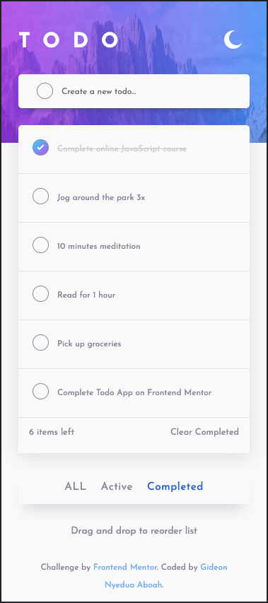

# AmaliTech-Frontend-Challenge
Frontend assessment for AmaliTech

## Welcome! 👋

This is a frontend challenge by AmaliTech.

## Table of contents

- [Overview](#overview)
  - [The challenge](#the-challenge)
  - [Screenshot](#screenshot)
  - [Links](#links)
  - [Customer requiremets](#customer-requirements)
- [My process](#my-process)
  - [Built with](#built-with)
  - [What I learned](#what-i-learned)
  - [Continued development](#continued-development)
  - [Useful resources](#useful-resources)

## The challenge

In this challenge, we are required to build a TODO App using HTML, CSS & JavaScript.
Assets including Figma design files, JPEG design files for both mobile & desktop layouts, Style guides and Optimized images were provided.
The project objective was to get the TODO App looking as close as the design as possible.

## Screenshot

## Links

- Solution URL: [(https://github.com/KwekuGideon7/AmaliTech-Frontend-Challenge)](https://github.com/KwekuGideon7/AmaliTech-Frontend-Challenge/)
- Live Site URL: [https://kwekugideon7.github.io/AmaliTech-Frontend-Challenge/](https://kwekugideon7.github.io/AmaliTech-Frontend-Challenge/)

## Customer requirements

1. View the optimal layout for the app depending on their device's screen size
2. See hover states for all interactive elements on the page
3. Add new to-dos to the list
4. Mark to-dos as complete
5. Delete to-dos from the list
6. Filter by all/active/complete to-dos
7. Clear all completed to-dos
8. Toggle light and dark mode
9. Drag and drop to reorder items on the list
10. Build this project as a full-stack application

## Built with

- HTML5
- CSS
- JAVASCRIPT

## What I learned

1. **HTML, CSS, and JavaScript Fundamentals:** Building a Todo App involves applying the core concepts of HTML, CSS, and JavaScript. It reinforces understanding of HTML tags, CSS styling, JavaScript event handling, DOM manipulation, and working with user input.

2. **Project Structure and Organization:** Developing a Todo App helps in understanding how to structure and organize code effectively. It involves dividing the code into manageable modules, creating reusable functions, and keeping the codebase clean and maintainable.

3. **Interactivity and User Experience:** Implementing interactivity in the app enhances the user experience. Junior developers learn how to handle user actions, update the UI dynamically, and provide real-time feedback to users.

4. **Debugging and Troubleshooting:** Throughout the project, i encountered various issues and bugs. Debugging skills improve as they identify and resolve issues by using debugging tools, logging techniques, and systematic problem-solving approaches.

5. **Responsive Design and Mobile Compatibility:** Making the app responsive and compatible with different screen sizes and devices helped me learn about responsive design principles, CSS media queries, and adapting the app's layout and behavior based on the screen size.

6. **Testing and Quality Assurance:** Testing the Todo App helped me understand the importance of thorough testing. I learnt to write test cases, perform manual testing, and identify and fix bugs to ensure the app functions correctly.

7. **Version Control:** Working on a project like a Todo App helped me to learn to use version control systems like Git. 

8. **Problem Solving and Learning Resources:** Building a Todo App provides opportunities to practice problem-solving skills and search for solutions independently. I encountered challenges and learned to leverage documentation, online resources, and developer communities for guidance and learning.

9. **Continuous Improvement:** I gained an understanding of the iterative nature of software development. They learn to seek feedback, iterate on their code, and continually improve their skills and understanding of best practices.

Overall, building a Todo App is a valuable learning experience that reinforces fundamental concepts, encourages problem-solving skills, and introduces various aspects of web development, setting the foundation for growth and further learning in the field.

## Continued development

I would love to develop the project with react in the near future.

## Useful resources

I found the following websites very helpful:

- [(MDN WEB DOCS)](https://developer.mozilla.org/en-US/)
- [(W3SCHOOLS)](https://www.w3schools.com/)

  
   
